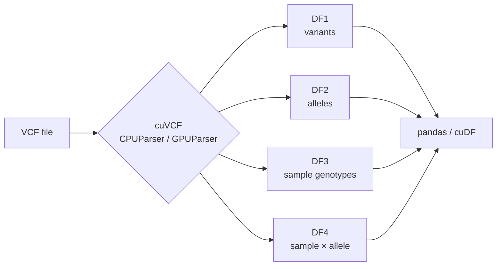
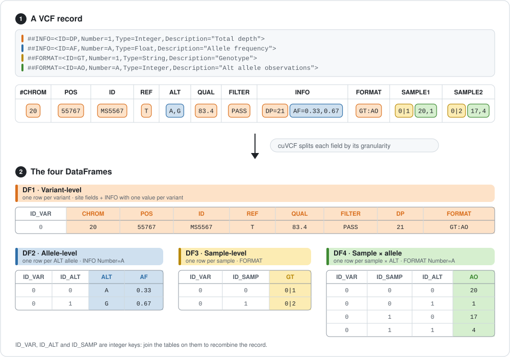

<div align="center">

# cuVCF

**Turn VCF files into analysis-ready DataFrames, fast, on CPU or GPU.**


-76B900)


</div>

---

cuVCF is a **hybrid CPU+GPU parser** that converts Variant Call Format (VCF) files into **normalized columnar tables**, ready to use with **pandas** or **cuDF**. No intermediate files, no custom query language: parse once, then filter and aggregate with the DataFrame syntax you already know.

- ⚡ **Fast**: a multithreaded CPU pipeline plus CUDA acceleration delivers substantial speedups over traditional tools.
- 🧬 **Tidy data model**: one VCF becomes four tables (variants, alleles, samples, sample×allele), so every field ends up at the right granularity.
- 🔁 **One API, two backends**: `CPUParser` and `GPUParser` expose exactly the same interface. Swap one import line.
- 🖥️ **GPU optional**: no NVIDIA GPU? Everything still builds and runs on the CPU.



---

## Table of contents

1. [Quick start](#quick-start)
2. [Installation](#installation)
3. [Usage from Python](#usage-from-python)
4. [The four tables](#the-four-tables)
5. [Command-line tools (debugging)](#command-line-tools-debugging)
6. [Troubleshooting](#troubleshooting)
7. [Requirements & tested environments](#requirements--tested-environments)
8. [Repository structure](#repository-structure)
9. [Benchmark datasets](#benchmark-datasets)
10. [Citation](#citation)

---

## Quick start

From a fresh Ubuntu machine to your first DataFrame in five steps:

```bash
# 1. System packages
sudo apt install build-essential cmake zlib1g-dev libimath-dev python3-dev python3-venv python3-pybind11

# 2. Get the code
git clone https://github.com/Mirkocoggi/cuVCF.git
cd cuVCF

# 3. Create and activate a virtual environment
python3 -m venv .venv
source .venv/bin/activate

# 4. Build and install (GPU backend included automatically if CUDA is found)
pip install .
pip install pandas

# 5. Check it works
python -c "import CPUParser; print('CPU backend OK')"
python -c "import GPUParser; print('GPU backend OK')"   # only if you have CUDA
```

Then, in Python:

```python
import CPUParser as cuvcf          # or: import GPUParser as cuvcf
import pandas as pd

res = cuvcf.vcf_parsed()
res.run("data/example.vcf", 16)    # path, number of CPU threads

variants = pd.DataFrame(cuvcf.get_var_columns_data(res.var_columns))
print(variants.head())
```

> 💡 **Tip:** Want the GPU backend? Install the [CUDA Toolkit](https://developer.nvidia.com/cuda-downloads) **before** step 4 and make sure `nvcc --version` works. See [GPU support](#gpu-support-optional).

---

## Installation

### Step 1: Prerequisites

On Ubuntu/Debian:

```bash
sudo apt install build-essential cmake zlib1g-dev libimath-dev python3-dev python3-venv python3-pybind11
```

#### GPU support (optional)

To build the GPU backend you also need the **CUDA Toolkit ≥ 11.8** (tested with 12.x and 13.x). Install it from the [NVIDIA website](https://developer.nvidia.com/cuda-downloads), then check that the compiler is visible:

```bash
nvcc --version
```

If you get `command not found`, add CUDA to your `PATH` and try again:

```bash
export PATH=/usr/local/cuda/bin:$PATH
nvcc --version
```

Without CUDA, the build simply skips the GPU backend and installs the CPU one.

### Step 2: Build

Choose **one** of the two options.

| | Option A: `pip` | Option B: CMake |
|---|---|---|
| **Use it if** | you want to use cuVCF from Python | you also want the CLI executables, or you are developing cuVCF |
| **You get** | `CPUParser`, `GPUParser` installed in your virtualenv | `CPUParser`, `GPUParser` modules + `VCFparser_cpu`, `VCFparser_gpu` CLIs in `build/` |
| **Recommended for** | ✅ most users | developers |

#### Option A: pip (recommended)

```bash
git clone https://github.com/Mirkocoggi/cuVCF.git
cd cuVCF
python3 -m venv .venv
source .venv/bin/activate
pip install .
```

- The **first build takes a few minutes** because it compiles the CUDA code.
- The **virtual environment is required** on recent Ubuntu/Debian releases, which refuse `pip install` into the system Python (`externally-managed-environment` error).
- A CMake newer than the one shipped by your distro is installed automatically if needed.

Useful variants:

```bash
# CPU-only build (skip CUDA even if it is installed)
pip install . -C cmake.define.CUVCF_CUDA=OFF

# Build for a specific GPU architecture (e.g. 80 = A100)
pip install . -C cmake.define.CMAKE_CUDA_ARCHITECTURES=80
```

#### Option B: CMake

```bash
git clone https://github.com/Mirkocoggi/cuVCF.git
cd cuVCF
cmake -S . -B build
cmake --build build -j
```

> ℹ️ **Note:** CMake **≥ 3.24** is required. Ubuntu 22.04 ships 3.22 via apt: get a newer one with `pip install cmake`.
>
> pybind11 can come from the distro (`python3-pybind11` / `pybind11-dev`) or from `pip install pybind11` in the same Python you will use.

Output in `build/`:

| File | What it is | Needs CUDA |
|---|---|---|
| `CPUParser.cpython-*.so` | Python module, CPU backend | no |
| `GPUParser.cpython-*.so` | Python module, GPU backend | yes |
| `VCFparser_cpu` | CLI, CPU backend | no |
| `VCFparser_gpu` | CLI, GPU backend | yes |

Build options (pass as `-D<option>=<value>` to the first `cmake` command):

| Option | Default | Meaning |
|---|---|---|
| `CUVCF_CUDA` | `AUTO` | `AUTO`: build the GPU backend if `nvcc` is found · `ON`: require it · `OFF`: CPU only |
| `CMAKE_CUDA_ARCHITECTURES` | `native` (or `75;80;86;89;90` if no GPU is visible) | GPU architectures to compile for, e.g. `89` |
| `CMAKE_BUILD_TYPE` | `Release` | `Debug` adds `-g` (plus `-G -lineinfo` for CUDA) and uses `-O0` instead of `-O3` |
| `CUVCF_SANITIZE` | `OFF` | Build the CPU targets with AddressSanitizer + UBSan |

<details>
<summary><b>Debug & sanitizer build (for developers)</b></summary>

```bash
cmake -S . -B build-dbg -DCMAKE_BUILD_TYPE=Debug -DCUVCF_SANITIZE=ON
cmake --build build-dbg -j
```

With `CUVCF_SANITIZE=ON`, the `CPUParser` module is linked against ASan, so the ASan runtime must be preloaded to import it:

```bash
LD_PRELOAD=$(gcc -print-file-name=libasan.so) ASAN_OPTIONS=detect_leaks=0 \
  PYTHONPATH=build-dbg python3 -c "import CPUParser"
```

</details>

### Step 3: Verify the installation

```bash
python -c "import CPUParser; print('CPU backend OK')"
python -c "import GPUParser; print('GPU backend OK')"   # CUDA builds only
```

After an Option B build, prefix the commands with `PYTHONPATH=build`.

---

## Usage from Python

### Running your scripts

| You built with | Run your script with |
|---|---|
| Option A (pip) | `source .venv/bin/activate` then `python my_script.py` |
| Option B (CMake) | `PYTHONPATH=build python3 my_script.py` |

### Complete example

```python
# Use the GPU backend if available, otherwise fall back to the CPU one
try:
    import GPUParser as cuvcf
except ImportError:
    import CPUParser as cuvcf

import pandas as pd            # or: import cudf as pd  (GPU DataFrames, same syntax)

# 1. Parse the VCF  (second argument = number of CPU threads)
res = cuvcf.vcf_parsed()
res.run("data/example.vcf", 16)

# 2. Extract the four tables as dicts of numpy arrays, then wrap them in DataFrames
DF1 = pd.DataFrame(cuvcf.get_var_columns_data(res.var_columns))      # variants
DF2 = pd.DataFrame(cuvcf.get_alt_columns_data(res.alt_columns))      # alleles
DF3 = pd.DataFrame(cuvcf.get_sample_columns_data(res.samp_columns))  # sample genotypes
DF4 = pd.DataFrame(cuvcf.get_alt_format_data(res.alt_sample))        # sample × allele

# 3. Explore
print(DF1.columns.tolist())
print(DF1.head())
```

### Example queries

Column names come from your VCF (for example from the `INFO` fields declared in the header). The queries below use fields found in Ensembl/EVA VCFs: run `print(DF1.columns.tolist())` to see what is available in yours.

```python
# Variants with the EVA_4 flag set
eva = DF1[DF1["EVA_4"] == 1]

# SNVs only (TSA == "SNV", encoded as 0)
snv = DF1[DF1["TSA"] == 0]

# Variants beyond position 200,000
high_pos = DF1[DF1["pos"] > 200_000]
```

### Export to CSV

```python
for name, df in {"df1": DF1, "df2": DF2, "df3": DF3, "df4": DF4}.items():
    df.to_csv(f"{name}.csv", index=False)
```

---

## The four tables

A VCF mixes fields that live at different levels (one value per variant, per allele, per sample, per sample *and* allele). cuVCF splits them into four normalized tables so that each field sits at its natural granularity.

<p align="center">
  
</p>

In the example above, a single record with two ALT alleles (`A,G`) and two samples becomes:

- **1 row in DF1**: the site fields plus `DP`, which has one value per variant;
- **2 rows in DF2**: one per ALT allele, carrying `AF` (declared `Number=A`, i.e. one value per ALT);
- **2 rows in DF3**: one per sample, carrying the genotype `GT`;
- **4 rows in DF4**: one per sample × ALT allele, carrying `AO` (a `FORMAT` field with `Number=A`).

Integer keys (variant, allele and sample IDs) link the tables, so you can always join them back together with a standard `merge`.

| Table | Function | Content | One row per |
|---|---|---|---|
| **DF1** | `get_var_columns_data(res.var_columns)` | variant-level fields | variant |
| **DF2** | `get_alt_columns_data(res.alt_columns)` | allele-level annotations | alternate allele |
| **DF3** | `get_sample_columns_data(res.samp_columns)` | per-sample genotypes | variant × sample |
| **DF4** | `get_alt_format_data(res.alt_sample)` | per-sample, per-allele metrics | variant × sample × allele |

`CPUParser` and `GPUParser` return the same tables with the same API. Use **pandas** on CPU or **cuDF** on GPU: the syntax is the same.

---

## Command-line tools (debugging)

The CLI executables (Option B only) are meant for **debugging and timing**. They parse a VCF into the internal columnar representation, print the parse time on `stderr` and the first 10 rows of each table on `stdout`. They do not provide an analysis workflow: for real work, use the Python modules.

```bash
./build/VCFparser_gpu -v data/tiny.vcf -t 4
./build/VCFparser_cpu -v data/tiny.vcf -t 4
```

| Flag | Meaning |
|---|---|
| `-v <file>` | Input VCF (`.vcf` or `.vcf.gz`), required |
| `-t <n>` | Number of CPU threads (default: 4) |

> ⚠️ **Warning:** A `.vcf.gz` input is **decompressed in place**: the `.gz` file is replaced by the uncompressed `.vcf`. Work on a copy if you need to keep the compressed original.

---

## Troubleshooting

| Problem | Cause | Fix |
|---|---|---|
| `error: externally-managed-environment` | Recent Ubuntu/Debian block `pip` on the system Python | Create and activate a virtualenv (`python3 -m venv .venv && source .venv/bin/activate`) |
| `ModuleNotFoundError: No module named 'CPUParser'` | Installed with a different Python, or `build/` not on the path | Use `python -m pip install .` with the interpreter you run; for CMake builds set `PYTHONPATH=build` |
| `CPUParser` works but `GPUParser` is missing | CUDA was not found at build time (the build log says `GPU backend skipped`) | Make `nvcc --version` work (see [GPU support](#gpu-support-optional)), then rebuild |
| `nvcc: command not found` | CUDA is installed but not on `PATH` | `export PATH=/usr/local/cuda/bin:$PATH` |
| CMake complains its version is too old | Ubuntu 22.04 ships CMake 3.22, 3.24+ is needed | `pip install cmake` (Option A does this automatically) |
| GPU module fails on another machine | The default `native` build only targets the build machine's GPU generation | Rebuild with `CMAKE_CUDA_ARCHITECTURES=<cc>`, e.g. `80` for A100, `89` for L40S/L4 |
| `import CPUParser` crashes after a sanitizer build | The ASan runtime is not loaded | Preload it, see [Debug & sanitizer build](#option-b-cmake) |

---

## Requirements & tested environments

**Build**

- CMake ≥ 3.24
- g++ with OpenMP and C++17 support
- zlib and Imath development packages (`zlib1g-dev`, `libimath-dev`)
- Python ≥ 3.8 with development headers (`python3-dev`) and pybind11
- *Optional:* CUDA Toolkit ≥ 11.8 with `nvcc` (tested with 12.x and 13.x)

**Runtime (Python)**

- `numpy`
- `pandas` for CPU analytics
- `cuDF` *(optional)* for GPU analytics

**Tested on**

| OS | GPU | Toolchain |
|---|---|---|
| Ubuntu 22.04.5 LTS | NVIDIA Ada (sm_89), e.g. L40S | |
| Ubuntu 24.04.4 LTS | NVIDIA L4 (sm_89) | CUDA 13.1, CMake 3.28, GCC 13, Python 3.12 |

Other NVIDIA GPUs work too: by default the build targets the GPU found on the build machine.

---

## Repository structure

```
cuVCF/
├── src/
│   ├── CPUVersion/          # CPU implementation and Python bindings
│   └── GPUVersion/          # GPU implementation and Python bindings
├── TestCPU/                 # Tests for the CPU backend
├── TestGPU/                 # Tests for the GPU backend
├── bcftoolsTest/            # Comparison scripts: bcftools
├── cyvcf2Tests/             # Comparison scripts: cyvcf2
├── vcflibTests/             # Comparison scripts: vcflib
├── CMakeLists.txt           # Build definition (CLIs + Python modules)
├── pyproject.toml           # pip install . (scikit-build-core)
├── Tester.bash              # Parsing-time benchmark via the CLI
├── TesterSanitizer.bash     # Memory-leak checks via the CLI
└── README.md
```

The benchmarking/comparison scripts need extra Python libraries and external tools: see the documentation in their folders.

---

## Benchmark datasets

The datasets used in our evaluation are publicly available:

| Dataset | Source |
|---|---|
| IRBT, *Bos taurus* population | [EVA PRJEB6119](https://ftp.ebi.ac.uk/pub/databases/eva/PRJEB6119/IRBT.population_sites.UMD3_1.20140322_EVA_ss_IDs.vcf.gz) |
| *Felis catus* | [Ensembl release 112](https://ftp.ensembl.org/pub/release-112/variation/vcf/felis_catus/felis_catus.vcf.gz) |
| *Bos taurus* | [Ensembl release 113](https://ftp.ensembl.org/pub/release-113/variation/vcf/bos_taurus/bos_taurus.vcf.gz) |
| *Danio rerio* | [Ensembl release 113](https://ftp.ensembl.org/pub/release-113/variation/vcf/danio_rerio/danio_rerio.vcf.gz) |

---

## Citation

📄 **Stay tuned!** A paper describing cuVCF is on its way. Citation details will be added here as soon as it is published.
